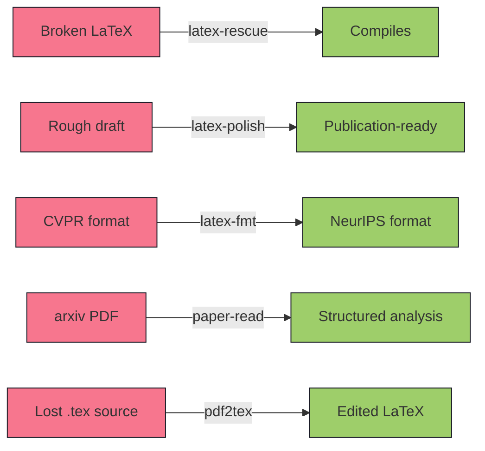
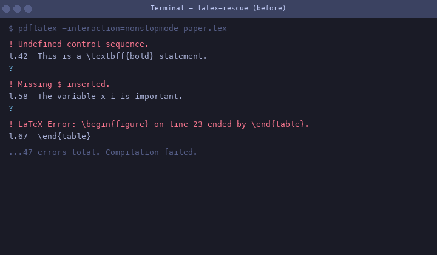
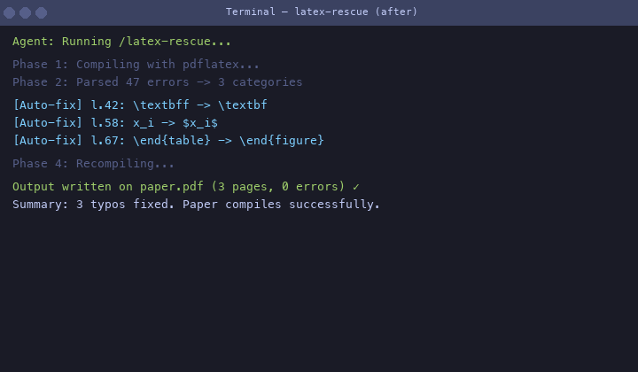
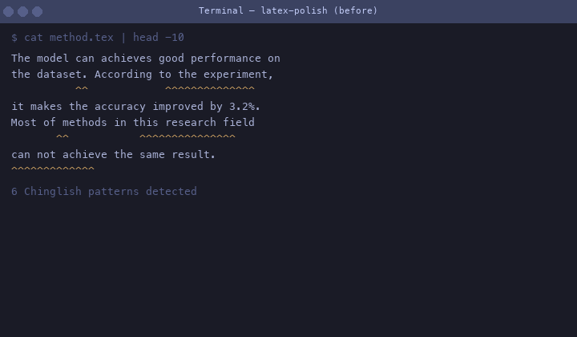
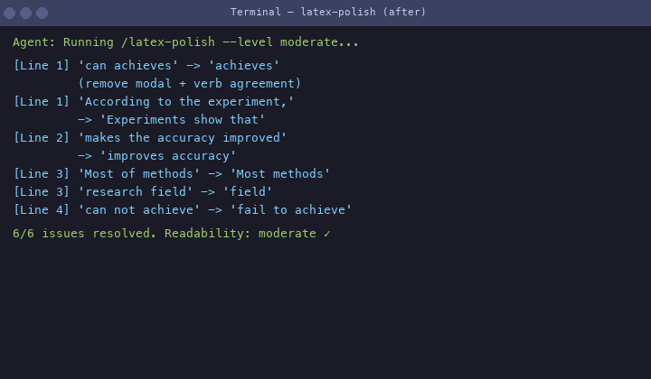
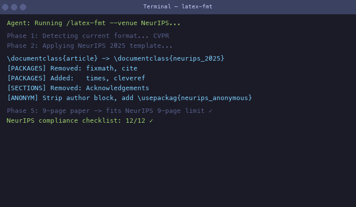
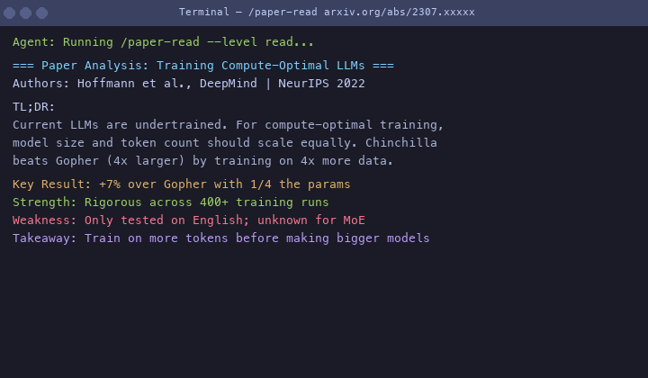
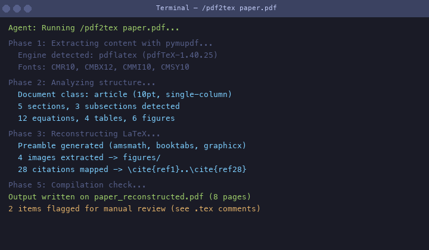

# awesome-latex-skills

<p align="center">
  <a href="https://github.com/Calix-L/awesome-latex-skills/actions"></a>
  
  
  
  
</p>

<p align="center">
  <b>AI Agent skills for LaTeX & academic workflows.</b><br>
  Fix compilation errors. Polish academic writing. Format for journals. Read papers. Recover LaTeX.<br>
  <i>Pure markdown prompt packs — no servers, no API keys, no dependencies.</i>
</p>

---

## Table of Contents

- [What problem does this solve?](#what-problem-does-this-solve)
- [Skills overview](#skills-overview)
- [See it in action](#see-it-in-action)
- [Architecture](#architecture)
- [Quick start](#quick-start)
- [Installation](#installation)
- [Project stats](#project-stats)
- [Roadmap](#roadmap)
- [Contributing](#contributing)

---

## What problem does this solve?

<p align="center">
  <b>LaTeX powers CS, physics, and math publishing. Everyone hits the same walls:</b>
</p>

| | | |
|---|---|---|
| **2 AM before deadline** | 47 cryptic compilation errors | No idea where to start |
| **Reviewer #2** | "English needs significant improvement" | What does that even mean? |
| **Camera-ready deadline** | Reformatted entire paper for new venue | Start from scratch |
| **50 papers to read** | Can't keep up with arxiv | Can't remember what you read |
| **Lost the .tex file** | Only have camera-ready PDF | Need to make edits |

**These are expertise problems, not tooling problems.** An AI agent with the right knowledge can solve them. These skills encode that knowledge.

---

## Skills overview

| Skill | What it does | Use when |
|---|---|---|
| **[latex-rescue](./latex-rescue/)** | Diagnoses and fixes compilation errors | `pdflatex` explodes with errors |
| **[latex-polish](./latex-polish/)** | Improves writing style and clarity | Reviewer complains about English |
| **[latex-fmt](./latex-fmt/)** | Reformats papers for 9 major venues | Switching templates |
| **[paper-read](./paper-read/)** | Reads and analyzes academic papers | Mountain of PDFs, no time |
| **[pdf2tex](./pdf2tex/)** | Converts PDF back to editable LaTeX | Lost .tex file, only have PDF |



---

## See it in action

### latex-rescue — fix 47 errors in 5 seconds

<p align="center">
  <b>Before</b><br>
  <br>
  <b>After</b><br>
  
</p>

**What happened:**
```diff
- \textbff{bold}          → undefined control sequence
+ \textbf{bold}           → typo auto-fixed

- x_i is important         → Missing $ inserted
+ $x_i$ is important       → math mode auto-fixed

- \begin{figure} ... \end{table}
+ \begin{figure} ... \end{figure}   → environment mismatch fixed
```

---

### latex-polish — Reviewer #2 no longer complains

<p align="center">
  <b>Before</b><br>
  <br>
  <b>After</b><br>
  
</p>

**What changed:**
```diff
- The model can achieves good performance on the dataset.
+ The model achieves strong performance on the benchmark.

- According to the experiment, it makes the accuracy improved by 3.2%.
+ Experiments show that the method improves accuracy by 3.2%.

- Most of methods in this research field can not achieve the same result.
+ Most methods in this field fail to match this result.
```

---

### latex-fmt — One command, new template

<p align="center">
  
</p>

```diff
- \documentclass{article}
+ \documentclass{neurips_2025}

- \usepackage{cite, fixmath}
+ \usepackage{times, cleveref}

- \section*{Acknowledgements}
+ [REMOVED — not allowed in anonymous submission]
```

---

### paper-read — Read papers at reviewer speed

<p align="center">
  
</p>

---

### pdf2tex — Recover lost LaTeX source

<p align="center">
  
</p>

```diff
- Only have paper.pdf, lost the .tex source
+ paper_reconstructed.tex (compilable, 8 pages)

- Extracted: 5 sections, 12 equations, 4 tables, 6 figures
+ Preamble + amsmath + booktabs + 28 citations mapped
```

---

## Architecture

```mermaid
flowchart TB
    subgraph Skill["Skill Directory (e.g. latex-rescue/)"]
        SKILL["<b>SKILL.md</b><br/>AI playbook<br/>• Role definition<br/>• Trigger words<br/>• Phase-by-phase workflow<br/>• Guardrails"]
        README["<b>README.md</b><br/>Human docs<br/>• What it does<br/>• How to install<br/>• Usage examples"]
        REFS["<b>references/</b><br/>Domain knowledge<br/>• Error catalog (85+ patterns)<br/>• Package conflicts (15 known)<br/>• Debug workflow<br/>• … 14 files total"]
        AGENTS["<b>agents/</b><br/>Platform config<br/>• claude.yaml<br/>• openai.yaml"]
    end

    AI["AI Agent<br/>(Claude Code, Cursor, Windsurf)"] -->|reads| SKILL
    AI -->|consults| REFS
    AI -->|uses| AGENTS

    style AI fill:#7dcfff,stroke:#1a1b26,color:#1a1b26
    style Skill fill:#1a1b26,stroke:#3b4261
    style SKILL fill:#9ece6a,stroke:#1a1b26,color:#1a1b26
    style README fill:#e0af68,stroke:#1a1b26,color:#1a1b26
    style REFS fill:#bb9af7,stroke:#1a1b26,color:#1a1b26
    style AGENTS fill:#7dcfff,stroke:#1a1b26,color:#1a1b26
```



**How it works:**
1. You type `/latex-rescue` (or just "fix my LaTeX errors")
2. The agent loads `SKILL.md` — it now knows its role, the exact 5-phase workflow, and the guardrails
3. As it works through each phase, it reads `references/` files for specific rules
4. The reference files encode **hundreds of precise rules** that LLMs can't reliably produce from memory
5. The result is consistent, expert-quality output — not "vibes-based" AI work

---

## Quick start

```bash
git clone https://github.com/Calix-L/awesome-latex-skills.git
```

### Claude Code

```bash
cp -r awesome-latex-skills/latex-rescue ~/.claude/skills/
```

Type `/latex-rescue` in any LaTeX project. Or just say "fix my LaTeX errors" — triggers auto-activate.

### Cursor / Windsurf / Any agent

Point the agent at the skill file:

```
Read awesome-latex-skills/latex-rescue/SKILL.md and follow the workflow.
```

---

## Installation

Your agent needs file read/write and shell execution capabilities.

For `latex-rescue`, LaTeX must be installed:

```bash
# macOS
brew install --cask basictex

# Ubuntu
sudo apt install texlive-latex-base texlive-latex-recommended texlive-latex-extra
```

---

## Project stats

| | |
|---|---|
| Skills | 5 |
| Reference files | 18 |
| Error patterns cataloged | 85+ |
| Package conflicts tracked | 15 |
| Venues supported | 9 |
| Chinese author patterns | 16 categories |
| Academic phrasebank sections | 9 |
| Test coverage | 45/45 passing |
| CI | GitHub Actions on push/PR |

---

## Roadmap

See [ROADMAP.md](./ROADMAP.md).

| Next | What |
|---|---|
| `review-response` | Parse reviewer comments → generate rebuttal letter |
| `grant-writing` | NSF / 国自然 proposal structure and critique |
| `arxiv-digest` | Daily arxiv scan → personalized TL;DR digest |
| `cover-letter` | Journal cover letter generation |

---

## Contributing

See [CONTRIBUTING.md](./CONTRIBUTING.md). Every error pattern, phrasebank entry, and Chinglish fix directly improves output quality.

- [Issue templates](./.github/ISSUE_TEMPLATE/) for bugs, features, and pattern contributions
- [PR template](./.github/PULL_REQUEST_TEMPLATE.md) with submission checklist

---

## License

MIT — see [LICENSE](./LICENSE)