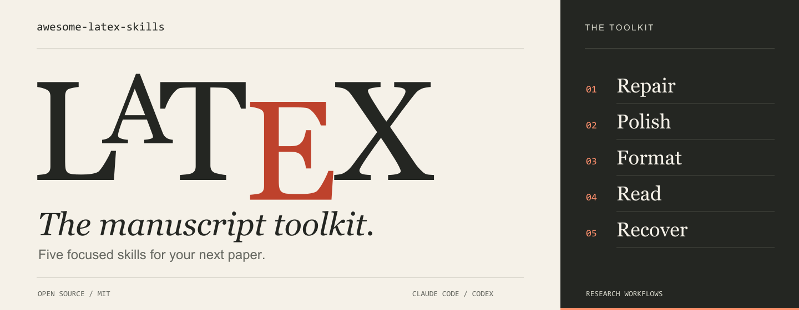
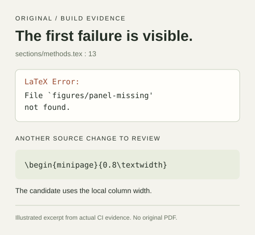
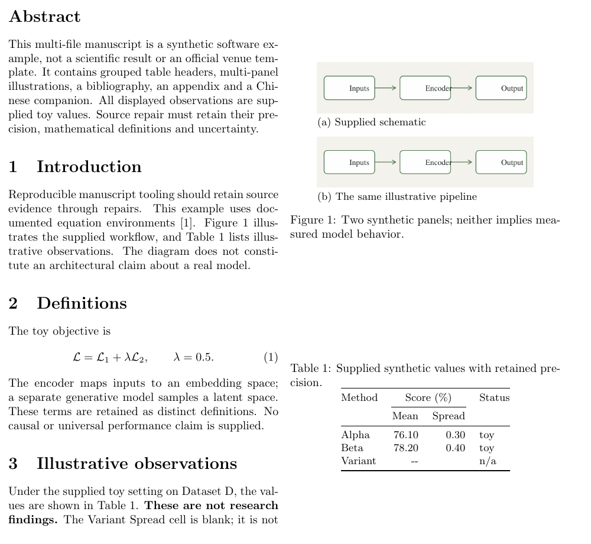
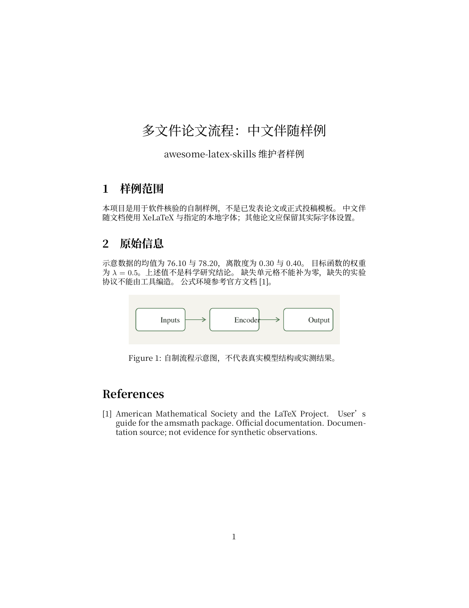
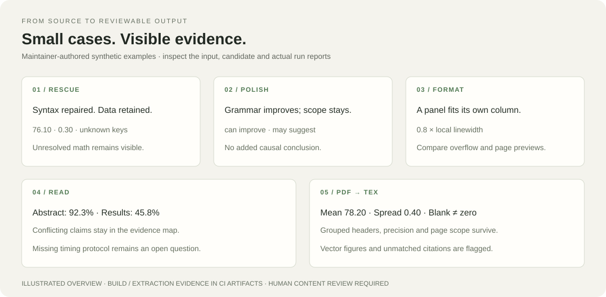
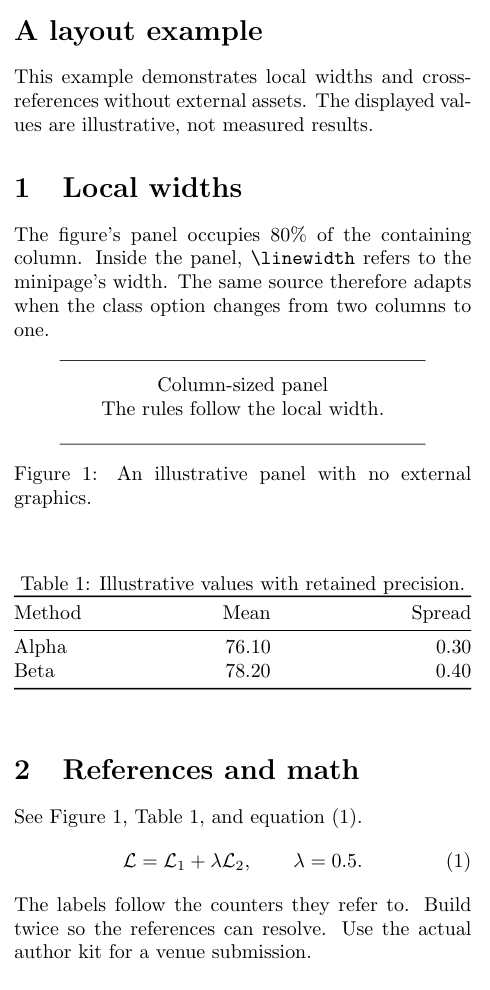
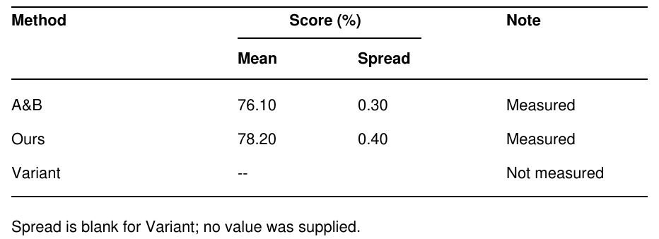

<picture>
  <source media="(prefers-color-scheme: dark) and (max-width: 600px)" srcset="./assets/cover-mobile-dark.svg">
  <source media="(max-width: 600px)" srcset="./assets/cover-mobile-light.svg">
  <source media="(prefers-color-scheme: dark)" srcset="./assets/cover-dark.svg">
  
</picture>

<p align="center">
  <a href="https://github.com/Calix-L/awesome-latex-skills/actions/workflows/test.yml"></a>
  <a href="./LICENSE"></a>
  <a href="https://github.com/Calix-L/awesome-latex-skills/releases"></a>
</p>

<p align="center">Five skills for LaTeX repair, academic editing, submission formatting, paper reading, and PDF recovery.</p>

<div align="center">

[Skills](#skills) &nbsp; / &nbsp; [Setup](#quick-start) &nbsp; / &nbsp; [Examples](#examples) &nbsp; / &nbsp; [FAQ](#faq)

<sub>**English** / [简体中文](./README_CN.md)</sub>

</div>

<br>

<a id="skills"></a>

## 01 / Choose your skill

Start with the problem in front of you. Each entry includes a workflow, references, and verification requirements.

| Skill | Purpose & deliverable |
| :--- | :--- |
| **[latex-rescue](./latex-rescue/SKILL.md)**<br><sub>01 / REPAIR</sub> | Diagnose build errors, make minimal source fixes, and report build evidence and remaining issues. |
| **[latex-polish](./latex-polish/SKILL.md)**<br><sub>02 / POLISH</sub> | Refine academic prose while preserving claims and numbers, at light, moderate, or strict intensity. |
| **[latex-fmt](./latex-fmt/SKILL.md)**<br><sub>03 / FORMAT</sub> | Migrate publication templates and report passed, failed, and unverified requirements against official guidance. |
| **[paper-read](./paper-read/SKILL.md)**<br><sub>04 / READ</sub> | Connect claims to evidence, from a quick skim to deeper appraisal, with locations in the original paper. |
| **[pdf2tex](./pdf2tex/SKILL.md)**<br><sub>05 / RECOVER</sub> | Reconstruct editable LaTeX from a PDF, flag uncertain content, and compare it with the original. |

<details>
<summary>Conference & journal guidance</summary>

NeurIPS · ICML · CVPR · ACL/EMNLP · ICLR · ECCV · AAAI · TMLR · IEEE ·
Nature · Science · COLING · KDD · SIGIR · Interspeech.

The [venue guide](./latex-fmt/references/templates/venue-guide.md) routes to official instructions.
Verify the requested year, track, article type, and submission stage; obtain official author kits separately.

</details>

<a id="quick-start"></a>

## 02 / Get started

Python **3.10+** · Windows / macOS / Linux · No third-party installer dependencies

```sh
git clone https://github.com/Calix-L/awesome-latex-skills.git
cd awesome-latex-skills
python -m pip install .
als install --agent claude
```

Using **Codex**? Change the last command to `als install --agent codex`.
Use `python3` if that is your system's Python command.

[Package installation & optional dependencies](./docs/install.md). Prefer a
checkout without installation? `python scripts/als.py` accepts the same commands.

**Invoke:** `/latex-rescue` in Claude Code or `$latex-rescue` in Codex. Natural-language requests work too.

**Get your first useful result.** Follow the [five task recipes](./docs/tasks.md)
for commands, expected outputs and the next check.

| Start here | What you can review |
| :--- | :--- |
| **[Diagnose your project](./docs/project.md#project-aware-prerequisites)** | Actual settings, local tools, missing resources and source locations |
| **[Inspect manuscript changes](./docs/tasks.md#polish)** | Original/candidate differences, author decisions and retained build evidence |
| **[Try the complete case](./examples/full-paper/README.md)** | A multi-file English/Chinese manuscript and an offline review report |

Planning to assess skill quality? Start with the [12-run evaluation pilot](./docs/pilot.md).
Read the [tested environments and interface policy](./docs/compatibility.md) before integrating reports.

<details>
<summary><strong>Install one skill, preview changes, or choose a destination</strong></summary>

```sh
# Preview first; no files are written
python scripts/install.py --agent codex --skill latex-rescue --dry-run

# Install only the selected bundle; repeat --skill to select more
python scripts/install.py --agent codex --skill latex-rescue

# Choose your own skills directory
python scripts/install.py --dest "path/to/skills" --skill paper-read
```

Each installation includes the entrypoint, references, scripts, and agent metadata.
Default destinations are `~/.claude/skills/` for Claude Code and
`$CODEX_HOME/skills/` for Codex (default `~/.codex/skills/`).
Identical bundles stay untouched; ordinary installation never replaces differing content.

</details>

<details>
<summary><strong>Update installed skills safely</strong></summary>

```sh
git pull --ff-only
python scripts/install.py --agent codex --update --dry-run
python scripts/install.py --agent codex --update
```

New installations record file SHA-256 hashes. `--update` replaces only bundles
that still match their receipt; local edits, additions, or deletions stop the
whole batch. There is no force-overwrite mode. Failed or interrupted updates
attempt to restore the old directories; failed rollback preserves recovery files
and reports their location.

Manually copied bundles without receipts can be adopted only when they exactly
match the current checkout (`adopt`). Back up and move differing old copies away,
or choose a new destination. `--dry-run` writes neither files nor receipts.
Use `--agent claude` for Claude Code.

Writers to the same skills directory use an exclusive lock. A second installer
stops with the lock path instead of racing an update. After an unhandled process
termination, confirm the original installer has stopped before removing its
`.awesome-latex-skills.lock`; active locks are never automatically expired.

</details>

<details>
<summary><strong>Using another agent or a chat interface</strong></summary>

Give your agent access to the complete skill directory, then ask:

```text
Read awesome-latex-skills/latex-rescue/SKILL.md and follow its workflow.
```

In a chat-only interface, provide the entrypoint and the relevant reference files.
Pasting `SKILL.md` alone leaves out supporting guidance. Local editing and
compilation depend on the tools available to that agent. The legacy
`agents/config.yaml` files are integration hints, not a universal configuration
API for every platform.

</details>

<a id="examples"></a>

## 03 / In practice

**A complete manuscript workflow.** Inspect the root and dependencies, build
with recorded project settings, then review source changes alongside retained
logs and actual PDF pages.

```sh
python -m pip install ".[pdf]"
als project check examples/full-paper/after --bundle work/project-inspection
als verify inspection work/project-inspection
als paper --output work/full-paper-run
```

[Explore the multi-file English & Chinese case](./examples/full-paper/README.md)
— sections, bibliography, local style, grouped table, figure panels and appendix.
The original fails; the repaired candidate must compile. Open
`work/full-paper-run/review/report.html` to inspect the source diff, build evidence,
page previews and the timing protocol still awaiting the author's decision.

[Project doctor & configuration](./docs/project.md) · [Unified change review](./docs/review.md)

Open `work/project-inspection/report.html` for located issues, dependency
resolutions and next steps. Transfer this complete directory to keep its JSON
and integrity manifest together. The full runner seals both inspection reports.

| Task | Where to look |
|---|---|
| Understand static issues | `project-inspection/report.html` |
| Inspect bibliography headers and repeated keys | [Bibliography guide](./docs/bibliography.md) |
| Check a transferred report | `als verify inspection path/to/report-directory` |
| Review source edits and real PDF pages | `full-paper-run/review/report.html` |

The review opens with file changes, literal content signals, author decisions
and build states; source diffs and complete evidence remain expandable.
Use `--language zh` on `als review` or `als paper` for a Chinese interface.

Inspection distinguishes comments, escaped backslashes and supported literal
examples while retaining real dependencies and source locations. Incomplete
regions are explicit, and automatic root selection retains all observed file
fingerprints. See [literal scan coverage](./docs/project.md#literal-examples-and-incomplete-regions).

Build/extraction reports follow the effective parsed output directory, including
repeated value options and literal dash-prefixed filenames. JSON captures the
attempted helper arguments and working directory. See the [CLI guide](./docs/cli.md).

**Keep delivery verifiable.** New review folders include checksums for the
report, source diff and retained PDF/log/page evidence. Check a transferred
folder or a complete downloaded release offline:

```sh
als verify review work/full-paper-run/review
als verify inspection work/full-paper-run/inspection-after
als verify release path/to/downloaded-release-assets
```

[Verification guide](./docs/verification.md). Checks establish agreement with
the stored manifest; producer authenticity and scientific fidelity remain separate.

**Actual build failure → verified candidate PDF**

<p align="center">
  
  
</p>

Original log excerpt and candidate PDF detail from the complete synthetic case.
[Build and rendering provenance](./assets/previews/README.md).

<details>
<summary><strong>Chinese companion: actual XeLaTeX output</strong></summary>



The example selects Noto Serif CJK SC explicitly. Your manuscript should retain
its actual template's font settings. [Complete source and checks](./examples/full-paper/README.md).

</details>

<br>



Explore complete cases: original input, candidate output, change report and
executable checks. Candidates are maintainer-authored; model improvement has
not been measured.

| Case | See the result | Evidence to inspect |
| :--- | :--- | :--- |
| **Repair** | [Broken → repaired TeX](./examples/rescue/README.md) | Fresh build, retained values, intentionally unresolved keys |
| **Polish** | [Grammar → preserved claims](./examples/polish/README.md) | Source diff, modality, technical components and negation |
| **Format** | [Overflow → column-sized panel](./examples/fmt/README.md) | Actual logs and local-width page previews |
| **Read** | [Paper → evidence map](./examples/read/README.md) | Conflicting results, source locations and missing protocol |
| **Recover** | [Two-page PDF → editable TeX](./examples/pdf2tex/README.md) | Character evidence, grouped headers, blank cells and uncertainty |

```sh
python -m pip install -r pdf2tex/requirements.txt
python scripts/als.py examples run --output work/example-run
```

Requires a local TeX engine. [Example guide](./examples/README.md) explains
portable runs and CI evidence downloads.

<details>
<summary><strong>Actual PDF details: compiled layout & original table</strong></summary>

| Native formatting output | Original PDF evidence |
| :---: | :---: |
|  |  |

Selected PDF details from synthetic examples. [Sources and rendering provenance](./assets/previews/README.md).

</details>

<details>
<summary><strong>What an individual edit looks like</strong></summary>

### Repair a syntax error

```diff
- \textbff{Results}
+ \textbf{Results}

- \begin{figure} ... \end{table}
+ \begin{figure} ... \end{figure}
```

Known syntax mistakes can be repaired. Ambiguous equations, table data, citation
keys, and labels remain author decisions; a successful build cannot resolve intent.

### Polish without changing the claim

```diff
- The model can achieves good performance on the dataset.
+ The model can achieve good performance on the dataset.

- According to the experiment, the accuracy is improved by 3.2%.
+ The experiments show a 3.2% improvement in accuracy.
```

Technical terms, numbers, uncertainty, and the meaning of “3.2%” stay intact.
The skill does not silently turn a relative percentage into percentage points.

</details>

<details>
<summary><strong>One interface; a reproducible quality workflow</strong></summary>

```sh
python scripts/als.py --json doctor
python scripts/als.py evaluate validate
python scripts/als.py sources
python scripts/als.py release --output dist/1.14.0
```

[CLI & JSON reports](./docs/cli.md) · [Ten-task evaluation protocol](./docs/evaluation.md) ·
[Source review register](./maintenance/README.md) · [Releases & migration](./docs/releases.md)

Prepared evaluation sessions contain only original inputs and the requested
skill context. Scores separate limited literal checks from evidence-backed
human review; examples are never reported as baseline/treatment model results.
The repeated-trial runner prepares 60 blind tasks by default and retains every
failure or missing run. Start with a two-task pilot:

```sh
als benchmark prepare --case polish-scope --trials 1 --output evaluation-runs/pilot-01
```

The [configured command runner](./docs/evaluation.md#execute-a-configured-command)
records actual execution, binary-safe logs and submitted file hashes; human
review templates keep missing scores explicit. Model attribution and billed
cost require real evidence. No measured quality gain is claimed.

</details>

<details>
<summary><strong>More requests: formatting, reading, and PDF recovery</strong></summary>

**Format a paper**

```text
Format this project for NeurIPS 2026, main track, anonymous review.
Use the official author kit. Preserve the scientific content and report
any requirements that could not be verified.
```

**Read with a purpose**

```text
Read this paper in deep mode. Explain the main claim, supporting evidence,
important assumptions, and what I would need to reproduce the result.
Cite the relevant sections, figures, or equations.
```

**Recover editable source**

```text
Reconstruct this text-based PDF as LaTeX. Keep the section order and
mark ambiguous notation, merged table cells, and missing assets.
Report whether the result was compiled and visually checked.
```

</details>

<details>
<summary><strong>Try a self-contained layout example</strong></summary>

Copy [layout-example.tex](./latex-fmt/assets/layout-example.tex) into a new working
directory and build it twice with your available TeX engine. It includes a panel,
a table and equation/figure/table references, with no external assets, fonts or
bibliography. Change `twocolumn` to `onecolumn` to compare the same content at
both widths. The example is included when installing only `latex-fmt`.

CI checks both modes with pdfLaTeX, XeLaTeX and LuaLaTeX. It is a layout example;
use the official author kit for the requested venue.

</details>

<a id="workflows"></a>

## 04 / From draft to delivery

| Your situation | Suggested sequence | Review before finishing |
|---|---|---|
| A draft will not build | `latex-rescue` | Final log, remaining warnings, rendered PDF |
| You are revising a manuscript | `latex-polish` → `latex-rescue` | Meaning-preserving diff and compilation |
| You are switching venues | `latex-fmt` → `latex-rescue` | Official rules, content-page boundary, anonymity |
| The original source is missing | `pdf2tex` → `latex-rescue` | Content coverage, equations, tables, visual comparison |
| You are reading related work | `paper-read` | Claims versus evidence and source locations |

Each step can also be used independently. Formatting does not upload or submit a paper.

## 05 / Check your environment

The bundles are instructions; external tools do the extraction and compilation.
Run a read-only prerequisite check before working on a local project:

```sh
python scripts/doctor.py --skill latex-rescue --engine pdflatex

# Match the actual project's engine and bibliography backend
python scripts/doctor.py --skill latex-fmt --engine xelatex --backend biber

# Machine-readable output; exit 1 means required prerequisites are not met
python scripts/doctor.py --skill pdf2tex --json
```

| Task | Local prerequisites | If unavailable |
|---|---|---|
| Compile or verify formatting | Project's TeX engine; selected bibliography backend | Diagnose from supplied logs; report compilation as unverified |
| Polish pasted text / read supplied text | No TeX compiler required | Editing/reading can proceed; PDF verification is separate |
| Extract a text-based PDF | PyMuPDF: `python -m pip install -r pdf2tex/requirements.txt` | Supply extracted text or configure an extraction tool |
| Recover a scanned PDF | A separate OCR workflow | Standard text extraction is insufficient |
| Apply venue rules | Official kit and author instructions | Mark unresolved rules unverified |

The doctor reports the running Python, the imported PyMuPDF version and module
path, and a suggested next step. It distinguishes a missing package, unsupported
version, broken import and a shadowing module. It does not install software,
compile a document, or certify submission readiness.

<details>
<summary><strong>Verify a fresh LaTeX build and retain the evidence</strong></summary>

For a conventional root document, from the repository root:

```sh
python latex-rescue/scripts/check_build.py path/to/paper.tex --output fresh-build
python latex-rescue/scripts/check_build.py path/to/paper.tex --output fresh-bib-build --engine xelatex --backend biber
python latex-rescue/scripts/check_build.py path/to/paper.tex --output final-check --until-stable --require-resolved
```

Choose the actual engine and bibliography backend; omit `--backend` when none
is needed. The output directory must be new. The helper retains per-pass logs,
transcripts, auxiliary files, PDF, and `build-report.json`, including process
exit codes and per-step diagnostics. Failed bibliography diagnostics come from
the backend log. Recorded local input fingerprints identify observed chapter,
style, or graphic changes; they are not a frozen project snapshot. It disables shell escape and stops on a failed
step or timeout. Output follows the root filename, and ordinary nested chapters
are supported. `--until-stable` bounds auxiliary settling; `--require-resolved`
fails on recognized unresolved citations/references or rerun requests. Without
that flag, success can still have unresolved citations or layout warnings.

The standalone helper is included when installing only `latex-rescue`. Keep the
project's existing build command for custom workflows. See the
[build guide](./latex-rescue/references/build-check.md) for options and report limits.

</details>

<details>
<summary><strong>Extract PDF evidence before reconstruction</strong></summary>

From the repository root:

```sh
python -m pip install -r pdf2tex/requirements.txt
python pdf2tex/scripts/extract_pdf.py paper.pdf --output extraction --pages 1-3,5 --images --render
```

Omit `--pages` to select all pages; `--images` is optional. Use a new output
directory. The result includes page-delimited UTF-8 text, layout/font/page/
metadata JSON, optional embedded images, and selected whole-page PNG previews
with `--render`. Preview resolution is 144 DPI by default (`--dpi 72-300`), with
a 20-million-pixel limit per page. Open `extraction/report.html` for an offline
page/text comparison with navigation, coverage, warnings, and source metadata.
The report supports narrow screens and dark mode; keep its output directory together.
Add `--chars` to retain individual glyph origins/bounding boxes for inspecting
scripts and small notation. Span text remains available; page geometry and
rotation matrices connect text coordinates with previews. See the
[extraction guide](./pdf2tex/references/pdf-extraction-guide.md#character-detail-and-page-coordinates).
Changed input fingerprints stop publication. Blank
text layers, repeated image placements, and separate soft masks are recorded.

This step performs no OCR or automatic LaTeX reconstruction. Check column order,
math, tables, and complete figure panels against the original pages. See the
[PDF extraction guide](./pdf2tex/references/pdf-extraction-guide.md).

</details>

<a id="faq"></a>

## 06 / FAQ

<details>
<summary><strong>Does installing a skill install LaTeX or a model?</strong></summary>

No. It copies the instruction bundle. Use the AI agent and TeX distribution
already configured for your work; the doctor reports missing local prerequisites.

</details>

<details>
<summary><strong>Can I use this with Overleaf?</strong></summary>

Yes: provide the error log and relevant source for diagnosis, or export the
complete project for local checks. The agent must clearly distinguish a proposed
fix from a repair that has actually been recompiled.

</details>

<details>
<summary><strong>Will PDF recovery recreate my original source exactly?</strong></summary>

No. A PDF loses macros and source structure. Reconstruction aims for editable,
faithful content and marks uncertainty. Equations, tables, references, and layout
need comparison against the original; scanned pages need OCR first.

</details>

<details>
<summary><strong>What does a passing CI badge prove?</strong></summary>

CI validates bundle metadata, self-contained resources and documentation links,
SVG assets, installation and managed updates, real PDF extraction, prerequisite
reports, fresh-build evidence, data-preserving fixtures, and real TeX/BibTeX/Biber compilation. Portable checks run
on Windows, macOS, and Linux with Python 3.10 and 3.13, including the minimum
supported PyMuPDF version. It does not certify an AI agent's editing quality or a manuscript's
compliance with current venue rules. See [the test guide](./tests/README.md).

</details>

## Contribute

Found a misleading rule, a missing error pattern, or an installation issue?
Open an [issue](https://github.com/Calix-L/awesome-latex-skills/issues/new/choose)
or send a focused pull request. Include a minimal example, expected behavior,
and an official source for any venue-specific requirement.

[Contributor guide](./CONTRIBUTING.md) · [Test guide](./tests/README.md) ·
[Changelog](./CHANGELOG.md) · [MIT license](./LICENSE)

<div align="center">

<br>

<sub>Built for researchers who want useful assistance and changes they can review.</sub>

</div>
