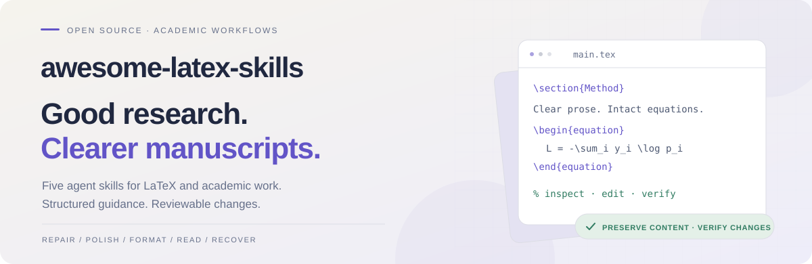

<div align="center">

<picture>
  <source media="(prefers-color-scheme: dark)" srcset="./assets/banner-dark.svg">
  
</picture>

<br>

### 为下一篇论文准备的实用工具箱。

修复 LaTeX、润色学术表达、转换投稿格式、读懂论文、恢复可编辑源码。<br>把具体任务交给有工作流、有参考知识、能说明验证结果的 AI Agent。

<p>
  <a href="https://github.com/Calix-L/awesome-latex-skills/actions/workflows/test.yml"></a>
  <a href="#skills"></a>
  <a href="./LICENSE"></a>
  <a href="https://github.com/Calix-L/awesome-latex-skills/stargazers"></a>
</p>

[English](./README.md) · **简体中文**<br><br>
[快速开始](#quick-start) · [技能一览](#skills) · [使用示例](#examples) · [组合工作流](#workflows) · [常见问题](#faq)

</div>

---

<a id="quick-start"></a>

## 快速开始

**Python 3.10+ · Windows / macOS / Linux · 安装器无需第三方依赖**

```sh
git clone https://github.com/Calix-L/awesome-latex-skills.git
cd awesome-latex-skills
python scripts/install.py --agent claude
```

使用 **Codex** 时，将最后一行改为 `python scripts/install.py --agent codex`。
如果系统的 Python 命令是 `python3`，替换命令名即可。

| Agent | 安装后的调用方式 | 默认安装位置 |
|---|---|---|
| Claude Code | `/latex-rescue` 或自然语言请求 | `~/.claude/skills/` |
| Codex | `$latex-rescue` 或自然语言请求 | `$CODEX_HOME/skills/`，未设置时为 `~/.codex/skills/` |

<details>
<summary><strong>只安装一个 Skill、预览改动、指定安装目录</strong></summary>

```sh
# 先预览，不写入任何文件
python scripts/install.py --agent codex --skill latex-rescue --dry-run

# 只安装指定 Skill；重复 --skill 可选择多个
python scripts/install.py --agent codex --skill latex-rescue

# 使用自己的 Skills 目录
python scripts/install.py --dest "path/to/skills" --skill paper-read
```

每次安装都会包含入口、参考文件和 Agent 元数据。已有 Skill 内容相同时保持原样；
内容不同时，整批安装会在写入前停止。更新前先备份并移走旧目录，或指定新路径。

</details>

<details>
<summary><strong>在其他 Agent 或纯聊天界面中使用</strong></summary>

让 Agent 能访问完整 Skill 目录，然后输入：

```text
Read awesome-latex-skills/latex-rescue/SKILL.md and follow its workflow.
```

在纯聊天界面中，需要提供入口及当前任务用到的参考文件。只粘贴 `SKILL.md`
会缺少配套知识。本地编辑和编译能力取决于 Agent 已配置的工具。
`agents/config.yaml` 是旧版集成提示，不是所有平台通用的配置 API。

</details>

<a id="skills"></a>

## 技能一览

按任务选择入口。每个 Skill 都包含独立工作流、领域参考资料，以及保护作者原意的约束。

| Skill | 适合什么情况 | 得到什么 |
|---|---|---|
| **[latex-rescue](./latex-rescue/SKILL.md)**<br>修复 | LaTeX 项目编译失败 | 最小源码修复、编译证据、未解决问题 |
| **[latex-polish](./latex-polish/SKILL.md)**<br>润色 | 学术英语需要更清晰 | 可审查的修改，支持轻度、中度、严格三档 |
| **[latex-fmt](./latex-fmt/SKILL.md)**<br>格式 | 转投或准备提交 | 模板转换及通过／失败／未验证的合规报告 |
| **[paper-read](./paper-read/SKILL.md)**<br>阅读 | 理解或评估一篇论文 | 有原文依据的速读、结构化精读或深度分析 |
| **[pdf2tex](./pdf2tex/SKILL.md)**<br>恢复 | 只有 PDF，需要可编辑 LaTeX | 重建源码，并标记需要核对的不确定内容 |

**投稿指导入口：** NeurIPS · ICML · CVPR · ACL/EMNLP · ICLR · ECCV · AAAI ·
TMLR · IEEE · Nature · Science · COLING · KDD · SIGIR · Interspeech。
[会议与期刊指南](./latex-fmt/references/templates/venue-guide.md)指向官方要求；使用前需要核验
目标年份、赛道、文章类型和投稿阶段。本仓库不附带官方模板包。

<a id="examples"></a>

## 使用示例

以下展示修改方式和请求写法，不是性能评测结果，也不保证所有任务都能自动完成。

### 修复明确的语法错误

```diff
- \textbff{Results}
+ \textbf{Results}

- \begin{figure} ... \end{table}
+ \begin{figure} ... \end{figure}
```

已知语法错误可以直接修复；有歧义的公式、表格数据、引用键和标签仍需作者判断。
编译成功无法证明修改符合作者原意。

### 润色表达，保留论断

```diff
- The model can achieves good performance on the dataset.
+ The model achieves good performance on the dataset.

- According to the experiment, the accuracy is improved by 3.2%.
+ The experiments show a 3.2% improvement in accuracy.
```

保留术语、数值、不确定性以及“3.2%”原有含义，不会擅自把相对百分比改为百分点。

<details>
<summary><strong>更多请求：投稿格式、论文阅读与 PDF 恢复</strong></summary>

**转换投稿格式**

```text
将这个项目改为 NeurIPS 2026 主赛道匿名评审格式。
使用官方模板，保留科学内容，并报告无法验证的要求。
```

**带着问题读论文**

```text
用 deep 模式阅读这篇论文。解释主要论断、支持证据、关键假设，
以及复现结果需要哪些条件。注明对应章节、图表或公式的位置。
```

**恢复可编辑源码**

```text
把这份有文本层的 PDF 重建为 LaTeX。保留章节顺序，
标记有歧义的符号、合并表格单元格和缺失素材。
明确说明是否完成编译和视觉核对。
```

</details>

<a id="workflows"></a>

## 组合工作流

| 当前任务 | 建议顺序 | 完成前核对 |
|---|---|---|
| 草稿编译失败 | `latex-rescue` | 最终日志、剩余警告、渲染后的 PDF |
| 修改论文表达 | `latex-polish` → `latex-rescue` | 含义保持不变的 diff 和编译结果 |
| 转换投稿目标 | `latex-fmt` → `latex-rescue` | 官方要求、正文页数边界、匿名信息 |
| 原始源码丢失 | `pdf2tex` → `latex-rescue` | 内容完整性、公式、表格、视觉对照 |
| 阅读相关工作 | `paper-read` | 论断与证据的对应关系、原文位置 |

每一步也可以独立使用。格式转换流程不会自动上传或提交论文。

## 检查本地环境

Skill 提供指导，提取和编译由外部工具执行。开始处理本地项目之前，可运行只读检查：

```sh
python scripts/doctor.py --skill latex-rescue --engine pdflatex

# 使用项目实际的引擎和参考文献后端
python scripts/doctor.py --skill latex-fmt --engine xelatex --backend biber

# JSON 报告；返回码 1 表示缺少必需的本地工具
python scripts/doctor.py --skill pdf2tex --json
```

| 任务 | 本地前提 | 不满足时 |
|---|---|---|
| 编译或验证格式 | 项目的 TeX 引擎、已选择的参考文献后端 | 可根据提供的日志诊断；编译状态标记为未验证 |
| 润色粘贴文本／阅读已提供文本 | 不需要 TeX 编译器 | 可继续处理文本；PDF 验证是另一步 |
| 提取有文本层的 PDF | PyMuPDF：`python -m pip install pymupdf` | 提供提取文本，或配置提取工具 |
| 恢复扫描 PDF | 单独的 OCR 工作流 | 普通文本提取无法完成 |
| 应用投稿规则 | 官方模板及作者指南 | 尚未确定的规则标记为未验证 |

诊断命令只检查本地依赖，不安装软件、不编译文档，也不认证稿件已经满足投稿要求。

<a id="faq"></a>

## 常见问题

<details>
<summary><strong>安装 Skill 会同时安装 LaTeX 或模型吗？</strong></summary>

不会。安装器只复制指导文件。使用你已配置的 AI Agent 和 TeX 发行版；
环境诊断命令会报告缺少的本地工具。

</details>

<details>
<summary><strong>可以配合 Overleaf 使用吗？</strong></summary>

可以提供错误日志和相关源码进行诊断，也可以导出完整项目进行本地验证。
Agent 应明确区分“提出修复方案”和“修复后已经重新编译”。

</details>

<details>
<summary><strong>PDF 恢复能精确还原原始源码吗？</strong></summary>

不能。PDF 已丢失宏和源码结构。恢复的目标是内容忠实、可编辑，并标出不确定之处。
公式、表格、引用和排版需要与原始 PDF 对照；扫描页面需要先做 OCR。

</details>

<details>
<summary><strong>CI 通过能证明什么？</strong></summary>

CI 验证元数据、本地资源和 README 链接、SVG 素材、安装行为、依赖诊断报告、
样例的数据保留，以及真实 TeX 编译。跨平台检查覆盖 Windows、macOS、Linux，
使用 Python 3.10 和 3.13。它不认证 AI 的实际编辑质量，也不保证论文符合当前
投稿规则。详见[测试说明](./tests/README.md)。

</details>

## 参与改进

发现规则不准确、缺少错误模式或安装失败？欢迎提交
[Issue](https://github.com/Calix-L/awesome-latex-skills/issues/new/choose) 或聚焦单个问题的 PR。
请附最小示例、预期行为；涉及会议规则时，注明官方来源。

[贡献指南](./CONTRIBUTING.md) · [测试说明](./tests/README.md) ·
[更新日志](./CHANGELOG.md) · [MIT 许可证](./LICENSE)

<div align="center">

<br>

<sub>为研究者提供有用的辅助，以及可以亲自审查的修改。</sub>

</div>
